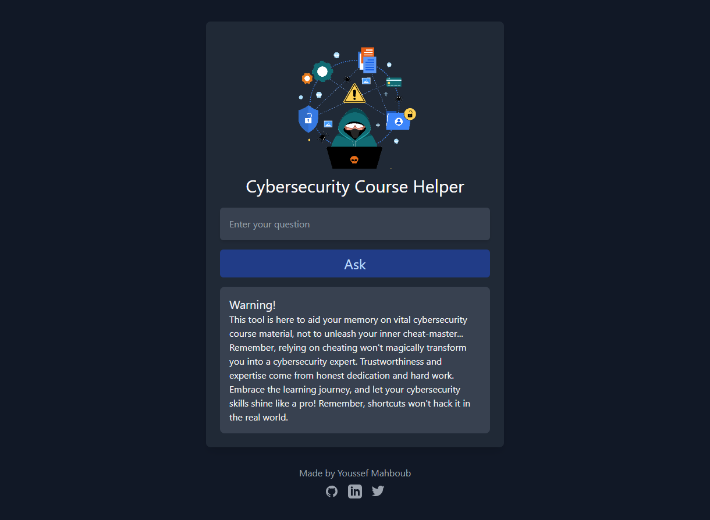

# Cybersecurity Course Helper

Welcome to **Cybersecurity Course Helper**! This web application is designed to assist you in studying the Google Cybersecurity Certificate with the power of AI. Whether you need to recall specific parts of the courses you've forgotten or simplify concepts you didn't fully grasp, this app is here to support your learning journey.

I built this web app to support me in my journey into the cyber security field, and i'm adding only the content I studied so far from the google cybersecurity certificate and i will add the rest of the content as I progress:

The "google-cybersecurity-course-content" contains TXT Files for the courses content:
Course 1 : Foundations of Cybersecurity ..... Added
Course 2 : Play It Safe: Manage Security Risks .... Soon
Course 3 : Connect and Protect: Networks and Network Security .... Soon
Course 4 : Tools of the Trade: Linux and SQL .... Soon
Course 5 : Assets, Threats, and Vulnerabilities .... Soon
Course 6 : Sound the Alarm: Detection and Response .... Soon
Course 7 : Automate Cybersecurity Tasks with Python .... Soon
Course 8 : Put It to Work: Prepare for Cybersecurity Jobs .... Soon

Note: you can always add the content by yourself if you are far ahead of me

## Table of Contents

- [Description](#description)
- [Tech Stack](#tech-stack)
- [Installation](#installation)
- [License](#license)
- [Support Me](#support-me)

## Description

Cybersecurity Course Helper is an AI-powered web app built to augment your learning experience with the Google Cybersecurity Certificate. By leveraging cutting-edge technologies like React.js, Node.js, Express.js, Langchain, and the OpenAI API, this tool provides you with the ability to answer any questions related to the Google Cybersecurity Certificate.

>

#### Warning!

This tool is here to aid your memory on vital cybersecurity course material, not to unleash your inner cheat-master... and Remember, relying on cheating won't magically transform you into a cybersecurity expert. Trustworthiness and expertise come from honest dedication and hard work. Embrace the learning journey, and let your cybersecurity skills shine like a pro!, shortcuts won't hack it in the real world.

## Tech Stack

The Cybersecurity Course Helper project utilizes the following technologies:

- React.js
- Node.js
- Express.js
- Langchain
- OpenAI API

## Installation

Clone this GitHub repository to your local machine:

    git clone https://github.com/youssefmahboub/Cybersecurity-Course-Helper.git

Navigate to the back-end directory:

    cd Cybersecurity-Course-Helper/back-end

Install the necessary dependencies:

    npm install

Create .env file and define the openai api

    OPENAI_API_KEY=*********************

Start the Express.js API server:

    node main.js

Open a new terminal and navigate to the front-end directory:

    cd Cybersecurity-Course-Helper/front-end

Install the required dependencies:

    npm install

Start the React.js development server:

    npm start

The Cybersecurity Course Helper web app will now be running locally on your machine. Access it by visiting http://localhost:3000 in your web browser.

## License

This project is licensed under the MIT License.

## Support Me

